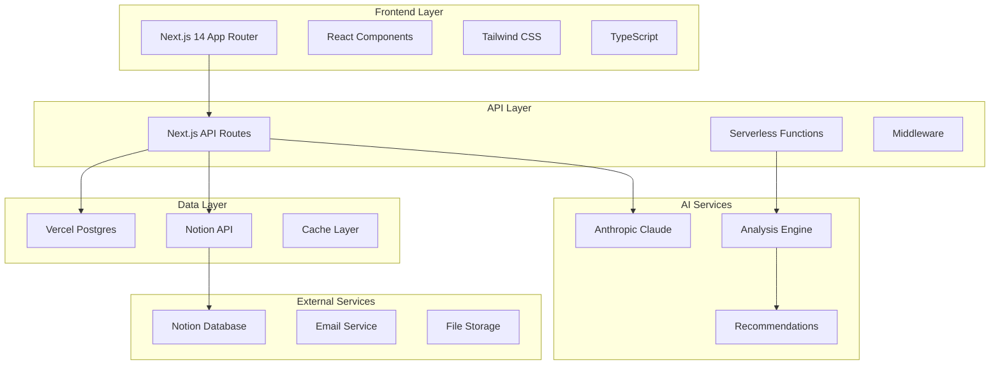
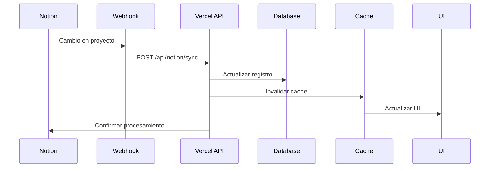
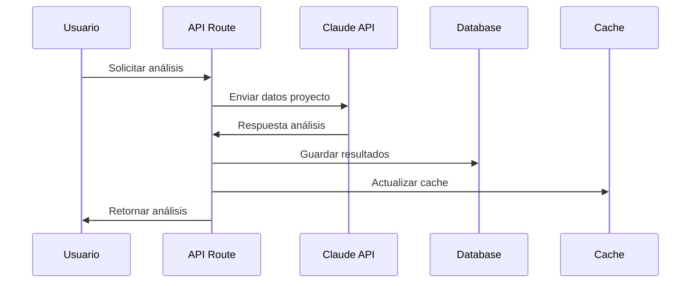
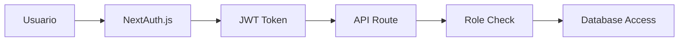
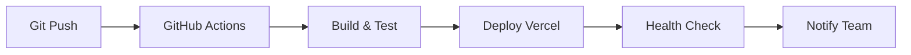

# UDFV Sistema de Gestión - Arquitectura Técnica

## 🏗 Visión General de la Arquitectura

El sistema UDFV está diseñado como una aplicación web moderna de una sola página (SPA) con arquitectura serverless, optimizada para el entorno de Vercel y con integración nativa de servicios de IA.

## 📐 Arquitectura del Sistema



## 🔧 Stack Tecnológico Detallado

### **Frontend Framework**
- **Next.js 14** con App Router
  - Server Components para optimización SEO
  - Client Components para interactividad
  - Image optimization automático
  - Route groups para organización

### **State Management**
- **React Context API** para estado global
- **useReducer** para lógica compleja
- **Custom hooks** para lógica reutilizable
- **Local Storage** para persistencia client-side

### **Styling & UI**
- **Tailwind CSS** con configuración personalizada
- **Headless UI** para componentes accesibles
- **Lucide React** para iconografía consistente
- **Framer Motion** para animaciones performantes

### **Type Safety**
- **TypeScript** en toda la aplicación
- **Zod** para validación de schemas
- **Type-safe APIs** con inferencia automática

## 🗄 Arquitectura de Datos

### **Modelo de Datos Principal**

```typescript
// Entidades principales
Usuario → Proyecto → Actividad
     ↓       ↓         ↓
  Análisis ← AI → Recomendaciones
```

### **Esquema de Base de Datos**

```sql
-- Tabla de usuarios del sistema
usuarios (
  id, nombre, email, rol, activo, 
  costo_hora, especialidades[], 
  created_at, updated_at
)

-- Proyectos principales
proyectos (
  id, nombre, descripcion, estado, prioridad,
  fecha_inicio, fecha_fin, presupuesto, 
  responsable_id, equipo_ids[], notion_id,
  viabilidad_score, riesgo_level, recomendaciones[]
)

-- Actividades de cada proyecto
actividades (
  id, proyecto_id, nombre, descripcion, estado,
  horas_estimadas, horas_reales, fecha_inicio, fecha_fin,
  asignado_id, notion_id
)

-- Análisis de IA
analisis_ia (
  id, proyecto_id, tipo, score, insights[],
  recomendaciones[], confianza, ejecutado_at
)
```

### **Relaciones Clave**
- Usuario 1:N Proyecto (responsable)
- Usuario N:N Proyecto (equipo)
- Proyecto 1:N Actividad
- Proyecto 1:N AnalisisIA

## 🔄 Flujo de Datos y Sincronización

### **Sincronización con Notion**



### **Análisis con IA**



## ⚡ Optimizaciones de Performance

### **Frontend Optimizations**
- **Lazy Loading** de componentes pesados
- **Image optimization** con Next.js Image
- **Bundle splitting** automático
- **Prefetching** de rutas críticas
- **Memoización** de componentes costosos

### **API Optimizations**
- **Response caching** con headers HTTP
- **Database connection pooling**
- **Parallel API calls** donde sea posible
- **Compression** automática de respuestas

### **Database Optimizations**
- **Índices** en columnas frecuentemente consultadas
- **Paginación** para listados grandes
- **Agregaciones** eficientes para métricas
- **Prepared statements** para queries recurrentes

## 🔐 Arquitectura de Seguridad

### **Autenticación & Autorización**


### **Niveles de Seguridad**
1. **Transport Layer**: HTTPS obligatorio
2. **Authentication**: JWT con expiración
3. **Authorization**: Role-based access control
4. **Input Validation**: Zod schemas
5. **Output Sanitization**: XSS prevention

### **Roles y Permisos**
- **Coordinador**: Acceso completo
- **Miembro**: Proyectos asignados + lectura general
- **Autoridad**: Solo reportes y métricas

## 📊 Arquitectura de Analytics

### **Métricas del Sistema**
- **Performance**: Core Web Vitals
- **Usage**: Page views, user flows
- **Business**: Project completion rates, ROI
- **Technical**: API response times, error rates

### **Dashboard de Métricas**
```typescript
interface MetricaDashboard {
  label: string
  valor: number | string
  tendencia?: 'up' | 'down' | 'stable'
  porcentajeCambio?: number
  tipo: 'numero' | 'porcentaje' | 'moneda' | 'tiempo'
  color?: 'success' | 'warning' | 'danger' | 'info'
}
```

## 🚀 Deployment y DevOps

### **CI/CD Pipeline**


### **Environments**
- **Development**: Local con hot reload
- **Preview**: Branches automáticos en Vercel
- **Production**: Dominio custom con CDN global

### **Monitoring & Observability**
- **Error Tracking**: Automatic error boundary
- **Performance**: Real User Monitoring
- **Uptime**: Synthetic monitoring
- **Logs**: Structured logging con metadatos

## 🔮 Escalabilidad y Futuro

### **Horizontal Scaling**
- **Serverless**: Auto-scaling por demanda
- **CDN**: Distribución global de assets
- **Database**: Connection pooling y read replicas
- **Cache**: Multi-layer caching strategy

### **Vertical Scaling**
- **Compute**: Vercel Pro para mayor memoria
- **Database**: Upgrade automático Postgres
- **AI**: Rate limiting inteligente
- **Storage**: Object storage para archivos

### **Extensibilidad**
- **Plugin Architecture**: Modular integrations
- **API First**: External integrations ready
- **Microservices**: Easy service extraction
- **Multi-tenant**: Institution support ready

## 📋 Decisions Log

### **Architectural Decisions**
1. **Next.js over React**: SSR + API routes integrated
2. **Tailwind over CSS-in-JS**: Performance + maintainability
3. **Postgres over NoSQL**: Relational data + ACID compliance
4. **Vercel over AWS**: Simplicity + developer experience
5. **Claude over OpenAI**: Better Spanish + reasoning capabilities

### **Trade-offs Accepted**
- **Vendor Lock-in**: Vercel ecosystem for simplicity
- **Monolith vs Microservices**: Monolith for faster development
- **Client-side vs Server-side**: Hybrid approach for best UX
- **Real-time vs Polling**: Polling for simplicity, webhooks for speed

## 🔧 Development Guidelines

### **Code Organization**
```
/app                 # Next.js app router
  /(dashboard)       # Route groups
  /api              # API endpoints
/components          # Reusable UI components
  /ui               # Base components
  /dashboard        # Feature components
/lib                # Utility functions
/types              # TypeScript definitions
```

### **Component Architecture**
- **Atomic Design**: Atoms → Molecules → Organisms
- **Composition over Inheritance**
- **Props drilling prevention** with Context
- **Error boundaries** for resilience

### **API Design Principles**
- **RESTful** endpoints where appropriate
- **Consistent** response formats
- **Proper** HTTP status codes
- **Comprehensive** error messages
- **Version-aware** for future changes

---

*Documento actualizado: Septiembre 2024*